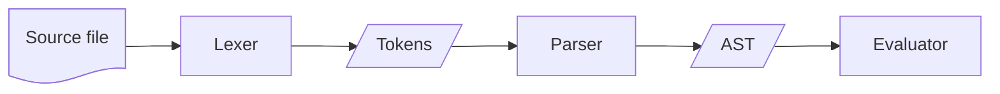
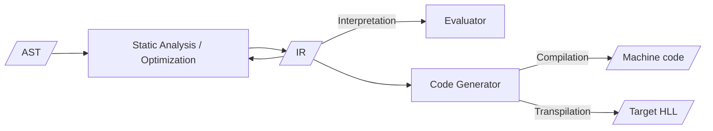

# Agenda

- AST Type
  - Some Examples
- Road to an Interpreter
  1. Substitution
  2. Single-Step Reduction
  3. Multi-Step Reduction
- Parsing
- Interpreters, Compilers, and Transpilers

---

# AST Type

We can build a lambda calculus abstract syntax tree (AST) using the following
recursive ADT:

```ocaml
type expr = Var of string
          | Abs of string * expr
          | App of expr * expr
```

---

# AST Type

## Some Examples

```
λx.x ≡ Abs ("x", Var "x")
```

<!-- pause -->

```
λx.λy.x ≡ Abs ("x", Abs ("y", Var "x"))
```

<!-- pause -->

```
λf.λx.f (f x) ≡ Abs ("f", Abs ("x",
                  App (Var "f",
                    App (Var "f", Var "x"))))
```

<!-- pause -->

```
(λx.x x)(λx.x x) ≡ let w = Abs ("x", App (Var "x", Var "x")) in
                   App (w, w)
```

---

# Road to an Interpreter

1. Substitution (i.e., [v/x]e)
2. Single-Step Reduction
3. Multi-Step Reduction

---

## 1. Substitution

```ocaml
val subst : expr -> string -> expr -> expr
```

- codifies β-reduction

- substitute expr `v` for var `x` in (body) expr `e`; i.e., [`v`/`x`]`e`

---

## 1. Substitution

Consider (id = Abs ("x", Var "x")):

1. subst id "z" (Var "z") = ?

2. subst id "z" (Var "y") = ?

3. subst id "z" (App (Var "w", Var "z")) = ?

4. subst id "z" (App (Var "z", Var "z")) = ?

5. subst id "z" (Abs ("x", Var "z")) = ?

6. subst id "z" (Abs ("z", Var "z")) = ?

---

## 1. Substitution

```ocaml
let rec subst (v : expr) (x : string) (e : expr) : expr =
  match e with
  | Var y -> if x = y then v else e
  | App (e1, e2) -> App (subst v x e1, subst v x e2)
  (* FIXME: this doesn't handle variable capture! *)
  | Abs (y, body) -> if x = y then e
                     else Abs (y, subst v x body)
```

---

## 2. Single-Step Reduction (Normal-Order)

```ocaml
val step_normal : expr -> expr option
```

- if arg `e` has a redex, reduce it and return `Some e'`, else return `None`

  - if multiple redexes, normal-order = leftmost/outermost first

<!-- pause -->

- driven by `subst` --- this approach to evaluation is known as the *substitution model*

---

## 2. Single-Step Reduction (Normal-Order)

Consider:

1. step_normal ( App (id, Var "x") ) = ?

2. step_normal ( App (App (id, id), App (id, id)) ) = ?

3. step_normal ( App (Var "x", App (id, id)) ) = ?

4. step_normal ( Abs ("x", App (id, Var "x")) ) = ?

5. step_normal ( Var "x" ) = ?

6. step_normal ( App (Var "x", Var "y") ) = ?

7. step_normal ( Abs ("x", App (Var "x", Var "y")) ) = ?

---

## 2. Single-Step Reduction (Normal-Order)

```ocaml
let rec step_normal : expr -> expr option = function
  | App (Abs (x, e1), e2) ->
      Some (subst e2 x e1)
  | App (e1, e2) -> (
      match step_normal e1 with
      | Some e1' -> Some (App (e1', e2))
      | None -> (
          match step_normal e2 with
          | Some e2' -> Some (App (e1, e2'))
          | None -> None))
  | Abs (x, e) -> (
       match step_normal e with
       | Some e' -> Some (Abs (x, e'))
       | None -> None)
  | Var _ -> None
```

---

## 3. Multi-Step Reduction (Normal-Order)

```ocaml
let rec eval_normal t =
  match step_normal t with
  | Some t' -> eval_normal t'
  | None -> t
```

- step until no more redexes remain, return resulting expr

<!-- pause -->

- may get stuck on non-terminating expressions! (e.g., (λx.x x)(λx.x x))

  - how can we avoid getting stuck? (can we?)

---

# Parsing

We cheated by starting with ASTs!

<!-- pause -->

A real interpreter starts with raw character data, which it *parses* into an
AST.

<!-- pause -->

Most modern parsers are created using *lexer and parser generators*, which
accept regular expressions and context-free grammars as input, and produce
working code (e.g., in OCaml) for parsing raw input.

---

# Parsing

## Lexer & Parser Generators in OCaml

We will use:

- `ocamllex` to generate lexers
- `menhir` to generate parsers

<!-- pause -->

You don't need to be able to write your own specifications for `ocamllex` and
`menhir`. We will provide working grammars for interpreters you will work on.

But it's good to have some idea of what's going on!

---

# Parsing

## Lexer

A *lexer* scans raw character data and turns it into a stream of *tokens*.

<!-- pause -->

E.g.,

input: `(λx.x)(λy.y)`

output:

```
LPAREN, LAMBDA, IDENT "x", DOT, IDENT "x", RPAREN,
LPAREN, LAMBDA, IDENT "y", DOT, IDENT "y", RPAREN
```

<!-- pause -->

Lexers recognize *regular languages* using *finite-state automata*.

---

# Parsing

## Lexer

Here's the specification for `ocamllex` for tokenizing lambda calculus
expressions:

```ocamllex
let ident = ['a'-'z' 'A'-'Z']+
let space = [' ' '\t']+

rule read =
	parse
	| space       { read lexbuf }
	| 'λ'         { LAMBDA }
	| '.'         { DOT }
	| ident as s  { IDENT s }
	| '('         { LPAREN }
	| ')'         { RPAREN }
	| eof         { EOF }
```

---

# Parsing

## Parser

A *parser* takes the tokens and, using a set of rules corresponding to the
grammar of the language being parsed, produces an AST.

<!-- pause -->

E.g., for the lambda calculus, here are the rules in BNF (they are a bit more complicated than the BNF we saw earlier, to account for left-associativity of function application)

```
<expr> ::= λ<var>.<expr> | <app>

<app>  ::= <app> <atom> | <atom>

<atom> ::= <var> | ( <expr> )
```

<!-- pause -->

Parsers recognize *context-free grammars* using *pushdown automata* (automata with a stack for memory).

---

# Parsing

## Parser

Here's the corresponding specification for `menhir` (the OCaml parser
generator):

```menhir
expr:
  | LAMBDA id=IDENT DOT body=expr   { Abs (id, body) }
  | e=app                           { e              }

app:
  | f=app arg=atom                  { App (f, arg)   }
  | e=atom                          { e              }

atom:
  | id=IDENT                        { Var id         }
  | LPAREN e=expr RPAREN            { e              }
```

---

# Parsing

## Parser

Consider the tokens returned by `ocamllex`, parsed using the `menhir` rules:

```
LPAREN, LAMBDA, IDENT "x", DOT, IDENT "x", RPAREN,
LPAREN, LAMBDA, IDENT "y", DOT, IDENT "y", RPAREN
```

```menhir
expr: LAMBDA id=IDENT DOT body=expr   { Abs (id, body) }
    | e=app                           { e              }
app:  f=app arg=atom                  { App (f, arg)   }
    | e=atom                          { e              }
atom: id=IDENT                        { Var id         }
    | LPAREN e=expr RPAREN            { e              }
```

---

# Parsing

## Parser

```
LPAREN, LAMBDA, IDENT "x", DOT, IDENT "x", RPAREN,
LPAREN, LAMBDA, IDENT "y", DOT, IDENT "y", RPAREN
```

`menhir` produces the AST:

```ocaml
App (Abs ("x", Var "x"), Abs ("y", Var "y"))
```

<!-- pause -->

which we can evaluate using our substitution-based `eval` from before!

---

# Interpreters, Compilers, and Transpilers

Here's the interpreter workflow described so far:



<!-- pause -->

Our evaluator doesn't perform any type-checking or other static analysis on the
AST -- we just evaluate it directly. This is something interpreters (for
type-safe languages) do; we will consider it later!

---

# Interpreters, Compilers, and Transpilers

Instead of evaluating the AST directly, interpreters will typically translate it
into a language-independent *internal representation* (IR).

<!-- pause -->

The IR may undergo additional analysis and optimization (e.g., desugaring)
before evaluation.

<!-- pause -->

A *compiler* will take the IR and generate code for the target (i.e., assembly
language or bytecode).

A *transpiler* will take the IR and generate code for some target high-level
language (e.g., OCaml -> JavaScript).

---

# Interpreters, Compilers, and Transpilers

Here is the fleshed out backend of the flowchart:



<!-- pause -->

The `LLVM` project is a popular compiler toolchain designed around a language-independent IR.

- Front-ends for the LLVM IR exist for C, C++, C#, Haskell, Java, ML, Objective-C, Ruby, Rust, Scala, Swift, etc.
- Back-ends for LLVM target IA-32, x86-64, ARM, MIPS, AMD GPUs, etc.

---

# Interpreters, Compilers, and Transpilers

We will *not* translate our AST into an IR.

- It's complicated, and we will not be performing any code generation

- Take CS 443 (Compiler Construction) if you're interested

<!-- pause -->

We will traverse our AST and evaluate it directly. This implementation is known
as a *tree-walk interpreter*.
